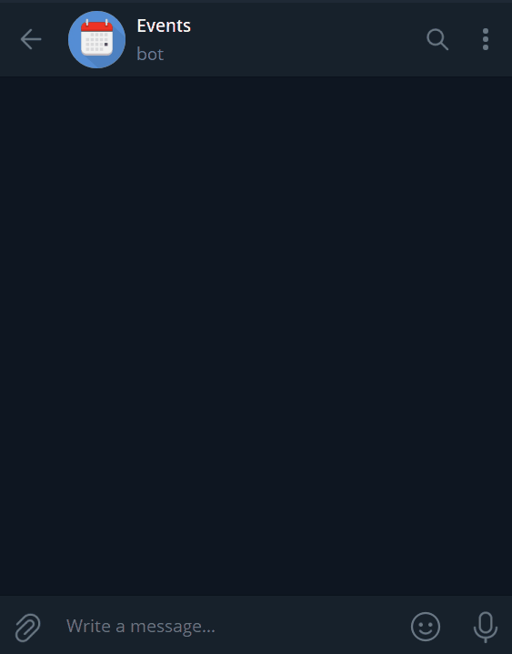

# Events - telegram bot for message scheduling

https://t.me/tg_event_scheduler_bot

Telegram bot for scheduling events (written in Rust of course). 

## Notes

Default timezone for messages is set to `Europe/Kiev`.

You can change it on per chat basis, see `/help` for list of commands.

See: [timezones wiki](https://en.wikipedia.org/wiki/List_of_tz_database_time_zones) for available timezone.
